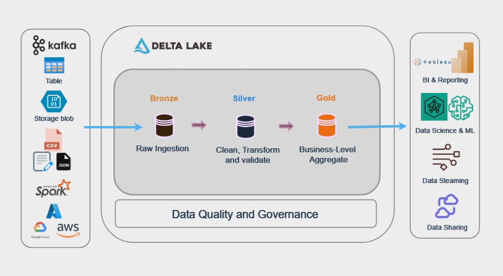

# Azure Spark DBT Project

## Overview

This project integrates **Azure Databricks** (Spark) with **dbt (Data Build Tool)** to enable scalable, modular, and maintainable data transformations in the cloud. It leverages Azure resources for data processing and dbt for analytics engineering.


## Features

- Data transformation using Apache Spark on Azure Databricks
- Modular SQL models managed by dbt
- Automated testing and documentation of data models
- Version control and CI/CD ready structure

## Project Structure

```
Azure_Spark_DBT/
├── dbt_project/           # dbt project directory (models, seeds, snapshots, etc.)
├── databricks_notebooks/  # Notebooks for Spark jobs and orchestration
├── scripts/               # Utility scripts (setup, deployment, etc.)
├── README.md              # Project documentation
└── requirements.txt       # Python dependencies
```

## Prerequisites

- Azure subscription
- Azure Databricks workspace
- Python 3.8+
- dbt (databricks adapter)
- Azure CLI

## Setup Instructions

1. **Clone the repository:**
    ```bash
    git clone <repo-url>
    cd Azure_Spark_DBT
    ```

2. **Install dependencies:**
    ```bash
    pip install -r requirements.txt
    ```

3. **Configure Azure Databricks:**
    - Set up a Databricks workspace and cluster.
    - Generate a Databricks access token.

4. **Configure dbt:**
    - Update `profiles.yml` with Databricks connection details.

5. **Run dbt models:**
    ```bash
    dbt run
    ```

## Deployment

- Use Azure DevOps or GitHub Actions for CI/CD.
- Deploy dbt models to Databricks using automated pipelines.

## Best Practices

- Modularize SQL models for reusability.
- Use dbt tests for data quality.
- Document models with dbt docs.
- Secure secrets using Azure Key Vault.

## Resources

- [Azure Databricks Documentation](https://docs.microsoft.com/azure/databricks/)
- [dbt Documentation](https://docs.getdbt.com/)
- [Azure CLI](https://docs.microsoft.com/cli/azure/)

## License

MIT License

---

*For questions or contributions, please open an issue or pull request.*